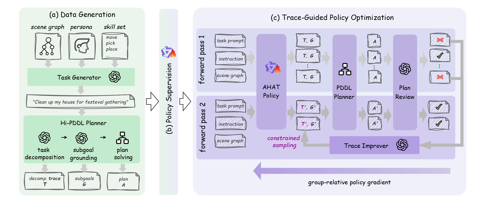

<div align="center">
  <h1>Any House Any Task: Scalable Long-Horizon Planning for Abstract Human Tasks</h1>
  <p><strong>A household task planner optimized for <em>long-horizon</em> planning in <em>large environments</em> given <em>ambiguous human instructions</em></strong></p>

  <p>
    <a href="https://arxiv.org/abs/2602.12244"></a>
    &nbsp;
    <a href="https://sii-liyang2024.github.io/ahat/"></a>
    &nbsp;
    <a href="https://deepwiki.com/Sii-liuzhihong/AHAT/1-ahat-overview"></a>
  </p>

  <p>
    <a href="https://huggingface.co/Sii-liuzhihong/AHAT-TGPO"></a>
    &nbsp;
    <a href="https://huggingface.co/datasets/SII-liyang2024/AHAT-dataset"></a>
  </p>

  <p>
    
    &nbsp;
    
  </p>
</div>

<div align="center">
  
  <p style="text-align:left;"><em>In large-scale environments, AHAT receives abstract instructions and a scene graph, generates a decomposition trace and corresponding subgoals. These subgoals are then solved using a PDDL planner, resulting in an executable long-horizon plan that satisfies the user’s requirements.</em></p>
  
  <p style="text-align:left;"><em>Overview of AHAT. (a) Data Generation: Task synthesis and annotation. (b) Policy Supervision: Supervised fine-tuning (SFT) on the constructed long-horizon household planning dataset. (c) Trace-Guided Policy Optimization: The reinforcement learning loop that integrates external correction of intermediate reasoning traces, improving subgoal generation and task decomposition through constrained sampling, and optimizing the AHAT model for robust planning performance.</em></p>
</div>

---

## Overview ✨

This repository contains the official implementation of **AHAT** (Any House Any Task), a household task planner optimized for scalable, long-horizon planning in large environments given ambiguous human instructions.

## Key Features

- **Scalable Long-Horizon Planning:** Robust performance in large-scale household environments without degradation from plan length or constraint complexity.
- **LLM-to-PDDL Grounding:** Maps ambiguous, brief human instructions and textual scene graphs into structured, executable PDDL subgoals.
- **TGPO Reinforcement Learning:** A novel RL algorithm building on GRPO that incorporates external corrections of intermediate reasoning traces to handle complex intentions.
- **Symbolic Reasoning Integration:** Leverages explicit symbolic solvers on generated subgoals to guarantee feasible and optimal execution plans.
## Open-Source Roadmap 🗺️

| Track              | Scope                                  | Status      | Target   |
| ------------------ | -------------------------------------- | ----------- | -------- |
| ✅ AHAT Pipeline   | AHAT planning pipeline + example cases | Released    | Done     |
| ✅ Model Weights   | AHAT model weights                     | Released    | Done     |
| ✅ Dataset         | AHAT 50k dataset + 308 scene graphs    | Released | Done |
| 🚧 Hi-Pddl-Planner | LLM task decomposition + PDDL planning | In Progress | 2026H2   |
| 🚧 TGPO RL Loop    | Trace-Guided Policy Optimization loop  | In Progress | 2026H2   |

## Installation 🛠️

```bash
# create conda environment
conda create -n ahat python=3.10 -y
conda activate ahat

# install dependencies
cd ahat
pip install -e .

# Note: PyTorch dependencies are CUDA-version specific.
# If you encounter errors, adjust torch/torchvision/torchaudio versions to match your CUDA version(change index-url accordingly).:
# pip uninstall torch torchvision torchaudio -y
# pip install torch torchvision torchaudio --index-url https://download.pytorch.org/whl/xxxx

# add fast-downward for solve pddl problems
git clone https://github.com/aibasel/downward.git fast_downward
cd fast_downward && ./build.py
cd .. && cp .env.example .env
```

- **Add to `.env`**: `FAST_DOWNWARD_PATH=/path/to/fast-downward/fast-downward.py`

## Quick Start ⚡

1. Download the model:

```bash
ahat download model
```

2. Download the data:

```bash
ahat download eval_set
```

3. Run the planning pipeline:

```bash
ahat pipeline local
```

## Alternative (Local Model Serving)

**Download the model and dataset** before running the pipeline in API mode:

1. Deploy the model locally:

```bash
pip install -e ".[deploy]"
python scripts/deploy_model.py
```

2. Add the API credentials to `.env`:

```bash
API_KEY=your_api_key
BASE_URL=http://127.0.0.1:8000/v1
MODEL_NAME=models/AHAT-TGPO
```

3. Run the pipeline with API mode:

```bash
ahat pipeline api
```

## Training Example 🏋️ (Coming Soon)

## Evaluation 📊 (Coming Soon)

## Citation 📚

If you find our work or code useful, please cite our paper:

```bibtex
@article{liu2026ahat,
  title={Any House Any Task: Scalable Long-Horizon Planning for Abstract Human Tasks},
  author={Liu, Zhihong and Li, Yang and Huang, Rengming and Lu, Cewu and Cai, Panpan},
  journal={arXiv preprint arXiv:2602.12244},
  year={2026}
}
```

## License 📄

This project is licensed under the MIT License.

## Acknowledgement 🙏

This project is built on top of excellent open-source ecosystems. We sincerely thank the teams behind [Fast-downward](https://github.com/aibasel/downward), [VAL](https://github.com/KCL-Planning/VAL), [Qwen](https://huggingface.co/Qwen), and [verl](https://github.com/verl-project/verl) for their impactful contributions.

We also welcome you to explore other work from our [lab](https://www.ropl.ai/), such as [UniDomain](https://roboticsjtu.github.io/UniDomain/), [MINT](https://renming-huang.github.io/MINT/), and [Vec-QMDP](https://sii-boluomonster.github.io/VecQMDP-website/).
